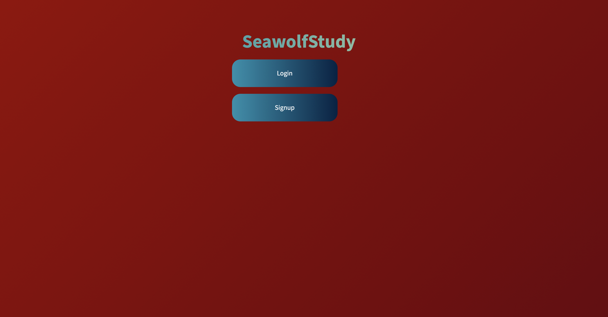
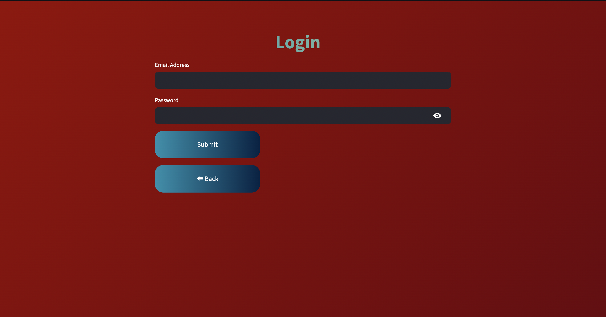
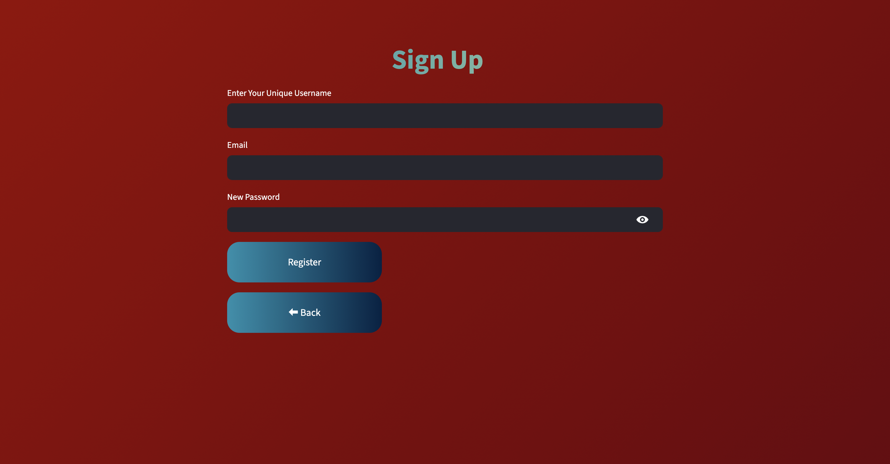
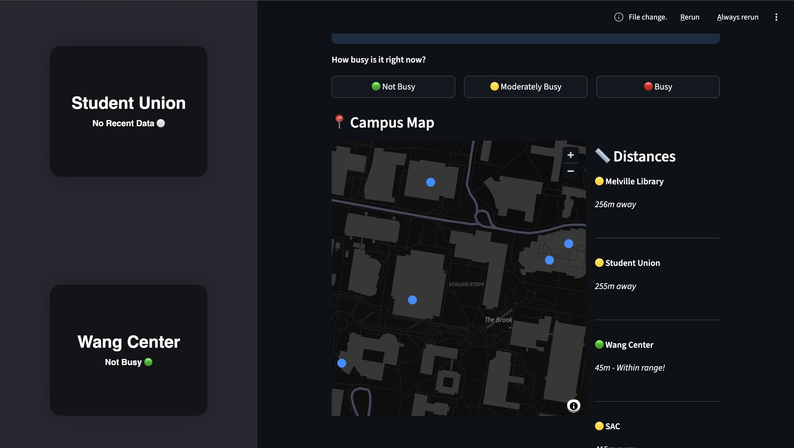

# SBU-Study-Spot-
Campus study spot finder using busyness level. Students get notified when they are within 100m range of the Library/Union/Wang/SAC to report crowd levels in the building. An algorithm calculate and shows the  status (Not Busy/Moderate/Busy) of the building reported by users. Created using Python libraries like Streamlit, SQLite, and Geopy. Stony Brook University Project

## Installation & Setup

### 1. Download the Project

Download the project folder and extract it to your desired location.

### 2. Navigate to Project Directory

Open your terminal and navigate to the project folder:

```bash
cd path/to/SeawolfStudy
```

Replace `path/to/SeawolfStudy` with the actual path where you downloaded the project.

### 3. Create Virtual Environment

Create a Python virtual environment:

```bash
python3 -m venv venv
```

### 4. Activate Virtual Environment

Activate the virtual environment:

**On macOS/Linux:**
```bash
source venv/bin/activate
```

### 5. Install Required Libraries

Install all the necessary dependencies:

```bash
pip install streamlit
pip install pandas
pip install streamlit-card
pip install geopy
pip install datetime
pip install streamlit-geolocation
```

Alternatively, if a `requirements.txt` file is provided:

```bash
pip install -r requirements.txt
```

### 6. Run the Application

Start the Streamlit application:

```bash
streamlit run main.py
```

The application should automatically open in your default web browser. If it doesn't, navigate to the URL shown in the terminal (usually `http://localhost:8501`).


### Home


### Login


### Sign Up


## App Page



